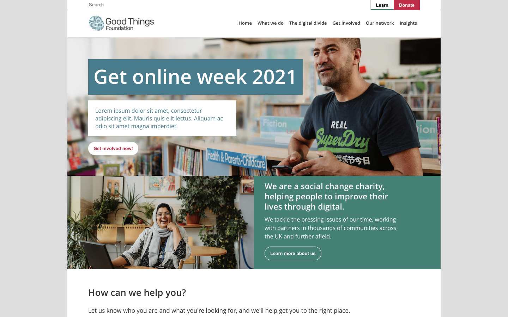

## GoodThings Foundation Vue.js



A template for the charity sector created with Vue.js

Technologies used:
- Vue.js
- Vuex
- Vue Router

[Check it out now](https://goodthings-foundation.github.io/)


## Project setup
```
yarn install
```

### Compiles and hot-reloads for development
```
yarn serve
```

### Compiles and minifies for production
```
yarn build
```

### Lints and fixes files
```
yarn lint
```

### Customize configuration
See [Configuration Reference](https://cli.vuejs.org/config/).
